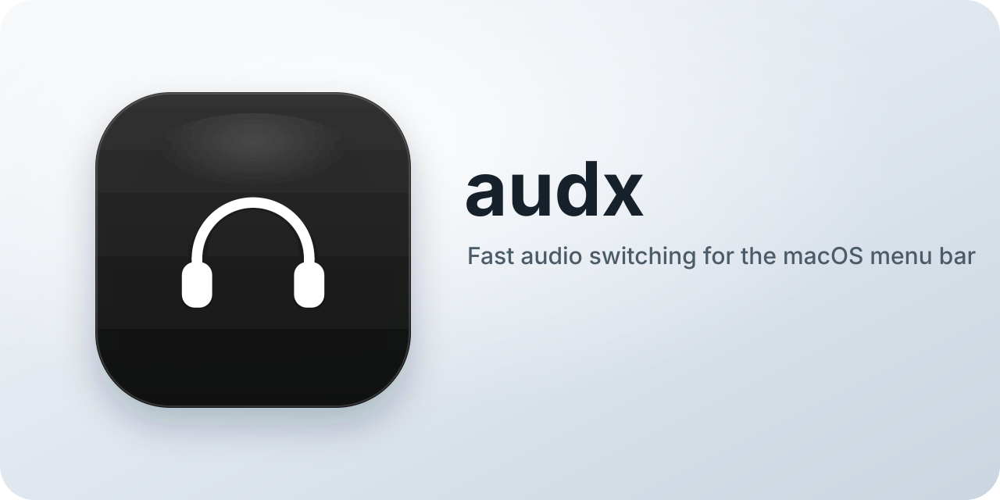

<p align="center">
  
</p>

## Overview

audx is built with the following features:

- Easily switch audio output and input devices from a compact menu bar popover.
- Use keyboard navigation and a global shortcut for quick access.
- Automatically disconnect idle Bluetooth audio devices after a configurable timeout.

## Installation

Install audx with Homebrew:

```bash
brew tap kwong/tap
brew install --cask audx
```

Or download the latest release from the [GitHub Releases](https://github.com/kwong/audx/releases/latest) page, open the DMG, and drag `audx.app` into Applications.

Launch audx from Applications. It runs as a menu bar app, so you will see its icon in the macOS menu bar rather than in the Dock.

If macOS shows a security warning the first time you open it, open `System Settings > Privacy & Security` and allow the app to run, then launch it again.

Alternatively, run the following command:
```bash
xattr -r -d com.apple.quarantine /Applications/audx.app
```

## Quick start

- Click the audx icon in the menu bar to open the device selector.
- Pick a device from the Output or Input section to switch immediately.
- Use the shortcut shown at the bottom of the popover to open audx without the mouse.
- Navigate with the arrow keys, press Return or Space to select, and press Escape to close.
- Adjust `BT Device Idle Timeout` when you want audx to disconnect idle Bluetooth audio devices automatically.
